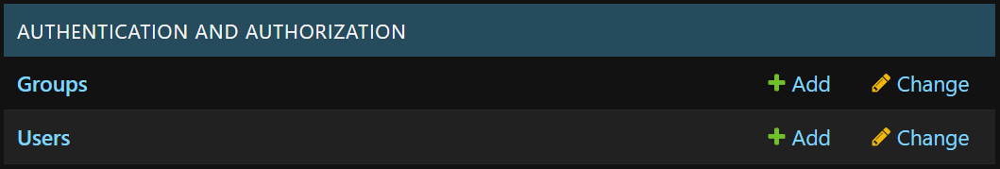
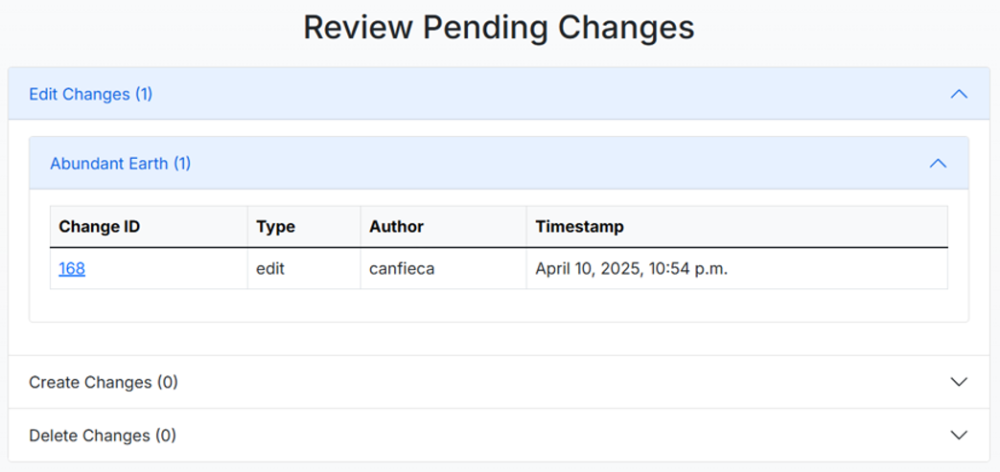
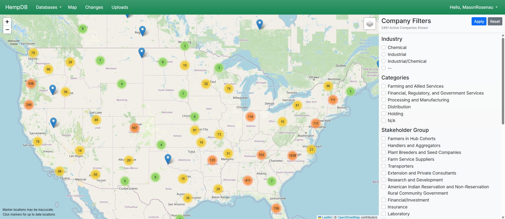

# HempDB

This repository hosts all code and documentation for the HempDB Senior Capstone Project, CS46X at Oregon State University.

## Contents
- [Project Identity](#project-identity)
- [Value Proposition](#value-proposition)
- [Technical Implementation](#technical-implementation)
- [Access and Usage](#access-and-usage)

## Project Identity

This web application is intended to aid the Oregon State University Center for Marketing and Consumer Insights in performing market research in the hemp industry. This research is supported by **USDA AFRI SAS Grant# 2021-68012-35957**. To learn more about the project, visit the [About Us](https://hempdb.vercel.app/about/) page.

### People

Dr. Johnny Chen, CMCI - *Project Partner* \
Cherish Despain, CMCI - *Research Assistant*

**2024-25 Software Team**
- Cameron Canfield - *Deployment Lead*
- Colton Melhase - *Product Manager*
- Joshua Henninger - *Backend Lead*
- Mason Rosenau - *Project Manager*
- Stryder Garrett - *Frontend Lead*
- Tanner Choy - *Infrastructure Researcher*

**2023-24 Software Team**
- Dylan Meithof
- Gabriele Falchini
- Paul Lipp
- Zachary Smith

### Project Status

The development of HempDB has gone through two iterations of the Oregon State University Senior Capstone Project, and it is expected to go through one more iteration during the 2025-2026 school year.

## Value Proposition

Previously, collation of industrial hemp companies and stakeholders was done using a shared spreadsheet. This solution was difficult to manage, prone to errors, and had no auditing or tracking to ensure data integrity. These issues, along with the magnitude of the data, led to the creation of HempDB.

### Features and Benefits

At its core, HempDB is backed by a relational database for easy and robust data storage and modeling. With user experience in mind, this website makes it easy for researchers to manage the large repository of company data, while also allowing them to share their research with the public. HempDB offers user roles and permissions, change approvals, geographical visualizations, and much more, allowing for better data integrity and market insights for researchers compared to a simple spreadsheet.

#### Permissions

HempDB allows site administrators to customize the permissions of users and groups on the site. These groups and permissions dictate the pages each user can view and the actions they can perform. This approach has introduced the public-facing aspect of HempDB and contributes to the security of the data.

Above is the Django administration portal, where site administrators can easily delegate permissions to users and groups.

For more information, see [Users, Groups, and Permissions](docs/ADMIN.md#users-groups-and-permissions).

#### Data Integrity

HempDB allows users and researchers to edit company data on the site. In order to ensure all changes are accurate and necessary, these changes go through a transaction approval process. Changes, whether they are edits, deletions, or creations, must be viewed and approved by an administrator.

Above is the pending changes page where site administrators can review changes submitted to companies.

In addition to this transaction approval process that ensures the accuracy of data, HempDB also features an auditing functionality to flag database entries that are incomplete. These features contribute to the goal of HempDB being an accurate, complete, and up-to-date source of data centralized around the industrial hemp industry.

For more information, see [Transaction Approvals](docs/ADMIN.md#transaction-approvals) and [Auditing Database Entries](docs/AUDIT.md#auditing-database-entries).

#### Data Insights and Visualization

HempDB allows users to filter companies in the database by any of their attributes. This feature is more comprehensive than it used to be on the previous spreadsheet solution. At the same time, HempDB allows users to export data, filtered or in its entirety, to spreadsheets for other research needs.

In addition to filtering and exporting, insights into the industry can be made geographically with the company map.

Above is the HempDB map that allows anyone to filter companies by any of their attributes and displays markers in heatmaps to see regional trends and density.

### Target Audience

HempDB aims to bring visibility to the industrial hemp industry. As a result, the target audience is individuals performing research in the industry, along with the general population.

## Technical Implementation

| Technology                                                                                             | Description                                                                                                                                                                         | HempDB Documentation                                                                                       |
|:------------------------------------------------------------------------------------------------------:|-------------------------------------------------------------------------------------------------------------------------------------------------------------------------------------|------------------------------------------------------------------------------------------------------------|
|                      | The frontend and backend of HempDB are constructed using Django. Django has templated frontend interfaces, backend logic written in Python, and more features that HempDB utilizes. | [File Structure](docs/FILES.md), [Django Admin Portal](docs/ADMIN.md#user-management-django-admin-portal ) |
|                                | HempDB uses MySQL to store all of its data. This is the backbone of the application, and it allows for more complex relational data.                                                | [Models](docs/MODELS.md), [MySQL Database](docs/INFRA.md#mysql-database)                                   |
|                                 | The HempDB website is deployed using Vercel, which offers great integration with GitHub.                                                                                            | [Vercel](docs/BUILD.md#vercel), [Website](docs/INFRA.md#website)                                           |
|  | GitHub Actions hosts workflows like continuous integration testing and deploying the documentation site.                                                                            | [GitHub Actions](docs/BUILD.md#github-actions)                                                             |

More technical information, including architecture, local development, and feature documentation, can be found in the [Developer Documentation](https://cmciosu.github.io/hemp-db/) (sourced from the [`docs/`](docs/) directory).

## Access and Usage

- Instructions for setting up, running, and developing on HempDB are located in [DEVELOP.md](docs/DEVELOP.md).
- User guides for public users and administrators are located in [USER.md](docs/USER.md) and [ADMIN.md](docs/ADMIN.md) respectively.
- To submit a bug report or feature request, please create a new issue [here](https://github.com/cmciosu/hemp-db/issues).
