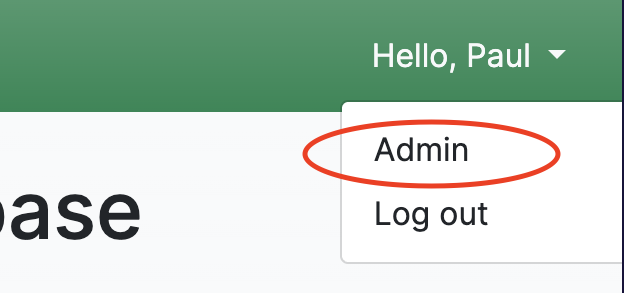

# Admin Users on HempDB

This page contains information for users with elevated privileges on the site.

## Users, Groups, and Permissions

Django applications have two built-in users "statuses": `staff` and `superuser`.

| Status      | Description                                                                   |
|-------------|-------------------------------------------------------------------------------|
| `staff`     | Designates whether a user can log into the Django admin portal.               |
| `superuser` | Designates that a user has all permissions without explicitly assigning them. |

In addition to the above Django statuses, there are `Groups` and `Permissions`.
* `Permissions` are individual permissions that grant access to do things on the site (e.g. performing specific CRUD operations on models).
* `Groups` contain a specific set of permissions.
* `Users` can be assigned to one or more groups, and they will inherit the group's permissions. Users can also be assigned individual permissions explicitly.

All of this can be configured in the Django admin portal (see next section).

## User Management: Django Admin Portal

Once logged in, staff users have the ability to access Django's admin portal by clicking on the "Admin" link in the username dropdown.

From here, staff users will be able to configure `Groups` (like what permissions each group has), `Users` (like granting `staff` and `superuser` status), and even perform the standard CRUD operations on all HempDB models.

One can refer to the [MDN web docs](https://developer.mozilla.org/en-US/docs/Learn/Server-side/Django/Admin_site) for more info on the Django admin portal.

## Company Model Objects

Only users that have the corresponding permissions can create new model objects (companies, categories, solutions, etc.). To create a new company, navigate to 

`Databases > Companies > Create`

The user will now be presented with a form containing all fields that the Company model has. 

Filling out the form should be as simple as filling out any form. Fields marked with a * are required; fields with a dropdown are foreign key relations and therefore only allow a certain set of options. Fields with checkboxes (like Solutions in the image) can have 0 to many selections. 

Clicking "Submit" at the bottom will add the company as a **Pending Change**. Any changes relating to Companies (create, edit, delete) all first go through the transaction approval process. 

To edit a company record, simply click on the **edit** button in the "Actions" column on the right of the Companies table. A pre-filled form will open, which one can edit and then submit. To delete a company, simply click on the trash can icon. All these changes are submitted for transaction approval, so nothing can be changed by accident.

## Transaction Approvals

All transactions regarding Companies (create, edit, delete) have to be approved by a staff user. To see all pending changes, navigate to the changes view by clicking "Changes" in the nav bar.

All currently pending changes will be listed here. One will find three types of changes: create, edit, deletion. As the names imply, they want to create, edit, delete a company, respectively. 

The changes view presents 3 drop-downs, each corresponding to the 3 change types.

Each drop-down will nest more drop-downs, each relating to a company, if there are changes for that company.

Each company drop-down will present a list that shows basic data about the change, such as the company name, the author of the change, and a timestamp.

These changes are sorted with the most recent being at the top of the list.

To approve / reject the proposed change, the staff user needs to click on the blue highlighted URL in the change list under each company.

Here the change can be approved or rejected. The staff user can also see all the columns for the Company, and their values.

1. For edit changes, 2 columns will be presented, the company column displays all the values currently set, and the pending company values displays the new values.
Any field that is different will be highlighted in red for convenience to easily understand what changes were proposed.

2. For create and deletion changes, 1 column will be presented. This column displays all the values the company will have if it is a create type, or will be deleted if its a deletion type.

Clicking Approve will approve the change, and the change will be processed immediately. Clicking Reject will delete the change from the Changes view, and the change will **not** be processed.

## Receiving Pending Change Emails

Any user in a group with the substring "admin" (i.e. the `Admin` and `SrAdmin` groups), will receive email notifications to the email associated with their account when a pending change is created. In other words, each time a company is created, edited, or deleted, and the change needs approval, these users will receive an email.

If a user would like to receive these emails, they can follow these steps:
1. Log in to [HempDB](https://hempdb.vercel.app/).
2. Click your username in the top right, and click `Admin` from the dropdown.
  * If you do not see `Admin` in this dropdown, contact someone with `staff` status to do the remaining steps for you.
3. Once in the Django admin portal, click `Users` on the left.
4. Click the name of the user. Emails will be sent to the email associated with this user's account.
5. Scroll down to the groups section and add the user to the `Admin` and/or `SrAdmin` group by clicking on either group and hitting the right arrow. Anyone in either of these groups will receive emails.
6. Click `Save` at the bottom of this page.

**Important:** These emails may first arrive in the Junk/Spam folder; from there you can trust the sender. Emails may also take up to 5 minutes to send from when the change is created.

## Resources

The `resource` table allows staff users to make changes to text and resources displayed on the website without having to make changes to the codebase. This table allows staff users to configure the following in the Django admin portal:

* Home Page Title
* Home Page Text
* About Page Text
* Contribute Page Text
* Contribute Page Contact (Email Address)
* Home Page Articles
  * These are the clickable resources seen at the bottom of the home page:

Resources can be accessed by clicking on the user's dropdown in the top-right when logged in as a staff user. Click on "Admin", and navigate to the Resources table under the HEMP DB module.

By clicking on resource object, the staff user can create, edit, delete any of these snippets. The table showing the snippets has the following columns:

### Resource Fields

To view the fields of the `resource` model in a table, visit the [models page](MODELS.md/#resource-model). 

1. Resource Type

Indicates what resource is managed by this snippet. Below are the mappings:

- Home Page Title --> home_title
- Home Page Text --> home_text
- About Page Text --> about
- Contribute Page Text --> contribute
- Contribute Page Contact (Email button) --> contribute_contact
- Home Page Articles --> article

2. Title

Only used for articles and homepage title. Title of the article, or title on homepage

3. URL

Only used for articles. Link to the article

4. Text

* For articles: a short description of the article
* For home_title: blank
* For home_text: text displayed on home page
* For about: text displayed on about page
* For contribute: text displayed on contribute page
* For contribute_contact: email of contact

5. Image URL

This is currently not supported

6. Priority

Only used for articles. Allows staff to indicate the order in which the articles appear on the home page. Articles with a lower `priority` value will appear first.
* For example, if Article A has a priority of `1` and Article B has a priority of `2`, Article A will appear before (to the left) of Article B.

### Managing Resources

We recommend **editing** existing resources, rather than creating new ones. When clicking a resource to edit it, all the relevant fields will be pre-filled, removing any confusion or ambiguity about what is required for the snippet to properly be displayed.

## Other Models

Users are able to see all models in the database by clicking the database dropdown (if they have the appropriate permissions).

These behave the same way as the Companies table. Staff users are able to create and delete records. These are **not** part of the transaction approval process, so any changes will be **processed immediately**.

## FAQ

### When creating a new company, the "Status" dropdown only shows 2 options. How do I add more options?

All dropdown and checkbox entry fields in the Company create form are controlled by the other models in the database. To add more options to the Status dropdown, navigate to `Databases > Status > Create` to create a new Status. Once created, it should show up as an option in the Company form. This behavior is identical for all the following fields:

* Solutions
* Categories
* Stakeholder Groups
* Stages
* Product Groups
* Status
* Grower
* Industry
