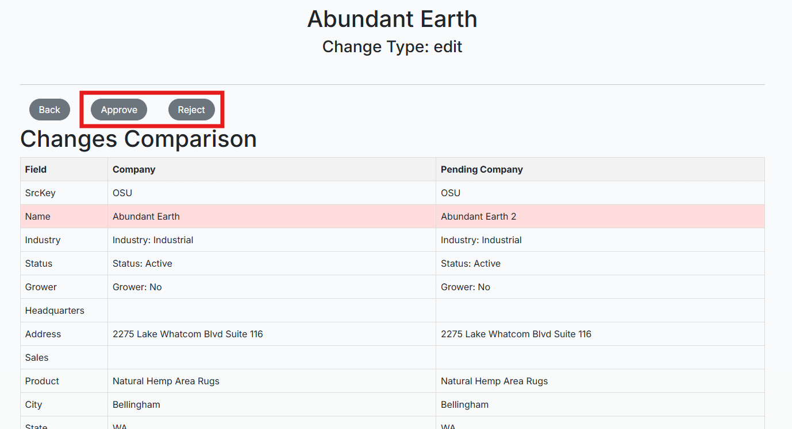

# Admin Users on HempDB

### This document contains information for users with staff / superuser privileges on the site. 

Admin users will be referred to as "staff users" in this document, following djangos permission conventions, but this encompasses staff and superusers

## User Management

Once logged in, staff users have the ability to access djangos admin portal by clicking on the "Admin" link in the username dropdown

From here, staff users can add new users, delete users, assign users to permission groups, and more. One can refer to the [MDN web docs](https://developer.mozilla.org/en-US/docs/Learn/Server-side/Django/Admin_site) for more info on the django admin portal.

## Company Model Objects

Only staff users have permissions to create new model objects (companies, categories, solutions, ...). To create a new company, navigate to 

`Databases > Companies > Create`

The user will now be presented with a form containing all fields that the Company model has. 

Filling out the form should be as simple as filling out any form. Fields marked with a * are required, fields with a dropdown are foreign key relations, therefore only allow a certain set of options. Fields with checkboxes (like Solutions in the image) can have 0 to many selections. 

Clicking "Submit" at the bottom will add the company as a **Pending Change**. Any changes relating to Companies (create, edit, delete) all first go through the transaction approval process. 

To edit a company record, simply click on the **edit** button in the "Actions" column on the right of the Companies table. A pre-filled form will open, which one can edit and then submit. To delete a company, simply click on the trash can icon. All these changes are submitted for approval, so nothing can be changed on accident.

## Transaction Approvals

All transactions regarding Companies (create, edit, delete) have to be approved by a staff user. To see all pending changes, navigate to the changes view by clicking "Changes" in the nav bar.

All currently pending changes will be listed here. One will find three types of changes: create, edit, deletion. As the names imply, they want to create, edit, delete a company, respectively. 

The changes view presents three columns:

1. Company ID

For change type deletion this refers to the ID of the company being proposed for deletion.

For change type edit this column is not useful. The important column here is "Affected ID", which indicates the ID of the company proposed for edit.

For change type create, the Company ID is also not useful information.

2. Change Type

3. Affected ID

Only used for edit actions to indicate the company proposed for edit.

To approve / reject the proposed change, the staff user needs to click on the blue highlighted URL in the Company ID column. 

Here the change can be approved or rejected. The staff user can also see all the columns for the Company, and their values. 

Clicking Approve will approve the change, and the change will be processed immediately. Clicking Reject will delete the change from the Changes view, and the change will **not** be processeds

## Admin Tools

Admin tools allow staff users to make changes to text and resources displayed on the website without having to make changes to the codebase. The text and resources that can be managed in the admin portal include:

- Home Page Title
- Home Page Text
- About Page Text
- Contribute Page Text
- Contribute Page Contact (email button)
- Home Page Articles

The admin tools can be accessed by clicking on "Admin Tools" in the navigation bar. Here, the staff user should be presented with the current values for the above mentioned snippets.

As with the Companies view, the staff user can create, edit, delete any of these snippets. The table showing the snippets has the following columns:

1. Resource Type

Indicates what resource is managed by this snippet. Below are the mappings:

- Home Page Title --> home_title
- Home Page Text --> home_text
- About Page Text --> about
- Contribute Page Text --> contribute
- Contribute Page Contact (email button) --> contribute_contact
- Home Page Articles --> article

2. Title

Only used for articles and homepage title. Title of the article, or title on homepage

3. URL

Only used for articles. Link to the article

4. Text

* For articles: a short description of the article
* For home_title: blank
* For home_text: text displayed on home page
* For about: text displayed on about page
* For contribute: text displayed on contribute page
* For contribute_contact: email of contact

5. Image URL

This is currently not supported

### Managing Snippets

For all snippets except articles, we recommend **editing** the current record, rather than creating a new one. When clicking edit, all the relevant fields will be pre-filled, removing any confusion or ambiguity about what is required for the snippet to properly be displayed

For articles, a staff user can simply click on create, choose "article" for resource type, and fill out the form

## Other Model Objects

Staff users are able to see all models in the database by clicking the database dropdown

These behave the same way as the Companies table. Staff users are able to create and delete records. These are **not** part of the transaction approval process, so any changes will be **processed immediately**

## FAQ

### When creating a new company, the "Status" dropdown only shows 2 options. How do I add more options?

All dropdown and checkbox entry fields in the Company create form are controlled by the other models in the database. To add more options to the Status dropdown, navigate to `Databases > Status > Create` to create a new Status. Once created, it should show up as an option in the Company form. This behavior is identical for all the following fields:

* Solutions
* Categories
* Stakeholder Groups
* Stages
* Product Groups
* Status
* Grower
* Industry

### I forgot my password, how can I reset it? 

Another staff user can navigate to the admin portal, click on the affected user, and reset the password manually.