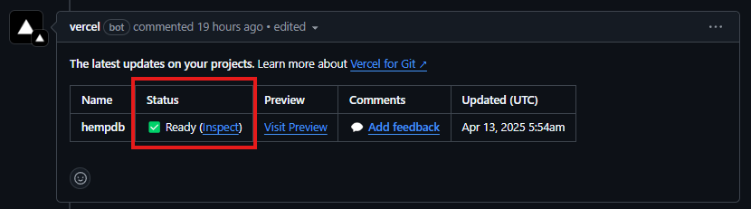

# Build Pipeline

This page contains information on the build pipeline for HempDB and is intended for developers.

## GitHub Actions

### CI Workflow

The [Django CI workflow](https://github.com/cmciosu/hemp-db/actions/workflows/migrate-test-lint.yml) is configured by the `migrate-test-lint.yml` file. This workflow runs on PRs opened to main. 

Its purpose is to run migrations, tests, and the lint check. This workflow must pass before a PR is merged to main. Tests are found in `helloworld/tests.py`.

### Pages Workflow

The [pages-build-deployment workflow](https://github.com/cmciosu/hemp-db/actions/workflows/pages/pages-build-deployment) deploys the markdown files in `docs/` to this documentation site.

## Vercel

Vercel runs `build.sh` for the build step. For this to pass, just make sure all dependencies are listed in `requirements.txt` and all versions are correct.

Once the Vercel build passes on a PR, Vercel will create a deployment for the PR. This is a site with your changes. The deployment can be visited by clicking the link highlighted below from the PR.

Note that these PR deployments are considered Preview deployments and not a Production deployment. As a result, they will use the `DATABASE_URL` environment variable that is associated with the Preview environment (the development database) on Vercel, not Production.

* Recent (Spring 2025) changes to the Django CI file `.github/workflows/migrate-test-lint.yml`:
    - `python manage.py migrate helloworld --fake-initial || python manage.py migrate helloworld --noinput`: intended to resolve common CI test deployment issues defensively. https://docs.djangoproject.com/en/5.2/topics/migrations/

        - `python manage.py migrate helloworld --fake-initial`: attempts to test the migration for a deployment assuming that initial migration changes have already been applied in the past. Necessary for first-time deployments when building the database from a backup or if it is initialized in another way.
        - `python manage.py migrate helloworld --noinput`: guarantees an attempt to migrate to the database from the start. Useful for resolving conflicts arising from missing migration files or inconsistent database schemas that may be ahead of other git branches.