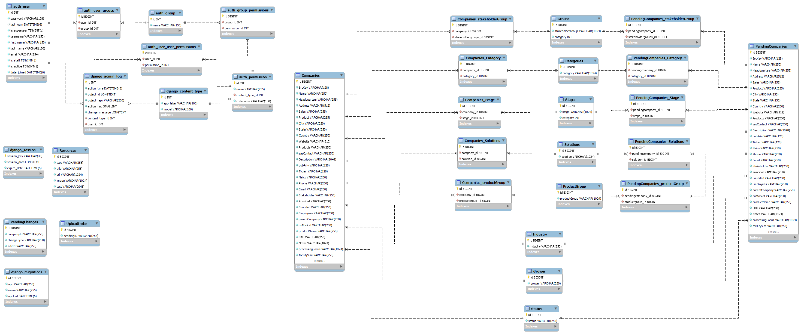

# HempDB Models

### The models defining our database schema. This documentation is intended for developers

Full EER Diagram

## Company

This is the main model representing the bulk of the data we store. Since the CMCI mainly collects data on companies, it only made sense to have Company be the main model. 

| Column            	| Description                                         	|
|-------------------	|-----------------------------------------------------	|
| SrcKey            	| Source Key - institution that created this entry    	|
| Name              	| Name of the Entity                                  	|
| Industry          	| Foreign Key Field - Choice of Industrial / Chemical 	|
| Status            	| Foregin Key Field - Choice of Active / Inactive     	|
| Grower            	| Foreign Key Field - Choice of Yes/No                	|
| Headquarters      	| Address of Headquarters (If available)              	|
| Address           	| Address of Business                                 	|
| Sales             	| Annual Revenue                                      	|
| Product           	| List of Products                                    	|
| City              	| Business City                                       	|
| State             	| Business State (US & Canada)                        	|
| Country           	| Business Country                                    	|
| Category          	| Many to Many field - Companies Category             	|
| Solutions         	| Many to Many field - Companies Solutions            	|
| Stakeholder Group 	| Many to Many field - Stakeholder Group                |
| Development Stage 	| Many to Many field - Development Stage               	|
| Product Group     	| Many to Many field - Product Group                    |
| SAS Contact       	|                                                     	|
| Description       	| Description of the Company                          	|
| Pub/Priv          	|                                                     	|
| Ticker            	|                                                     	|
| Naics             	|                                                     	|
| Phone             	| Phone                                               	|
| Email             	| Email                                               	|
| Stakeholder       	|                                                     	|
| Principal         	|                                                     	|
| Founded           	| Year Founded                                        	|
| Employees         	| Number of Employees                                 	|
| ParentCompany     	| Parent Company                                      	|
| OnMarket          	|                                                     	|
| ProductName       	| Name of Product                                     	|
| SKU               	|                                                     	|
| Notes             	| Any Notes about the Company                         	|
| ProcessingFocus   	|                                                     	|
| FacilitySize      	|                                                     	|
| BiomassCap        	|                                                     	|
| ExtractionType    	|                                                     	|
| GMP               	|                                                     	|
| News              	| Any recent news or headlines                        	|
| Reviews           	| Public Reviews                                      	|

## PendingCompany

This is a duplicate of Company, but meant to hold companies that are awaiting approval by an admin. This table is intended to work in tandem with the PendingChange table

## PendingChange

This table holds information on all pending changes. This table serves as the data source for the "changes approval" feature that admins have access to. It displays all currently pending changes that need to be reviewed (approved or denied). Changes can be deletes (a company deletion), edits (a company edit), or a creation (company creation). 

| Column     	| Description                                                                                 	|
|------------	|---------------------------------------------------------------------------------------------	|
| CompanyID  	| ID of the PendingCompany (if type == edit, create) OR ID of the Company (if type == delete) 	|
| ChangeType 	| Type of Change Pending. One of edit, create, delete                                         	|
| editId     	| ID of company to be edited (if type == edit), else blank                                    	|

## Solutions

This table has a many to many relationship with Companies. It holds the id and name of a Solution (as defined by CMCI) 

## Category

This table has a many to many relationship with Companies. It holds the id and name of a Category (as defined by CMCI) 

## ProductGroup

This table has a many to many relationship with Companies. It holds the id and name of a Product Group (as defined by CMCI) 

## Stage

This table has a many to many relationship with Companies. It holds the id and name of a Stage (as defined by CMCI) 

## StakeholderGroup

This table has a many to many relationship with Companies. It holds the id and name of a Stakeholder Group (as defined by CMCI) 

## Company_Solutions

This is a join table holding a company ID and a Solution ID.

## Company_Category

This is a join table holding a company ID and a Category ID. 

## Company_ProductGroup

This is a join table holding a company ID and a Product Group ID.

## Company_Stage

This is a join table holding a company ID and a Stage ID.

## Company_StakeholderGroup

This is a join table holding a company ID and a Stakeholder Group ID.

## Resources

This table holds all the resources that can be managed in the admin tools. 

| Column            	| Description                                         	|
|-------------------	|-----------------------------------------------------	|
| Type            	| Type of resource (details in [Admin Documentation](ADMIN.md))    	|
| Title | Used for home page title and articles |
| Url | Used for articles only. Link to article |
| text | text body. details in [Admin Documentation](ADMIN.md) |
| image | image URL. not supported at the moment |

## Django Tables

Django creates and manages its own internal models. Documentation on those can be found [here](https://docs.djangoproject.com/en/2.1/ref/contrib/auth/#django.contrib.auth.models.User.groups).

