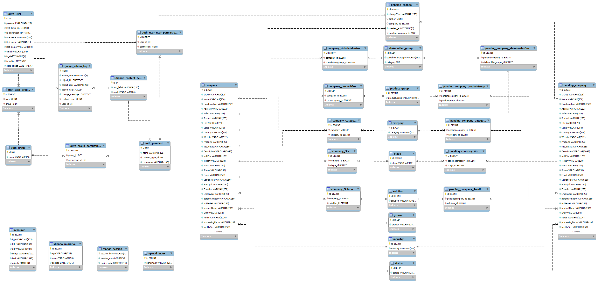

# HempDB Models

This page outlines the models defining our database schema and is intended for developers

## EER Diagram

## `company` Model

This is the main model representing the bulk of the data we store. Since the CMCI mainly collects data on companies, it only made sense to have company be the main model. 

| Column          | Description                           |
|-----------------|---------------------------------------|
| id              | Unique primary key int                |
| SrcKey          | Institution that created this entry   |
| Name            | Name of the company                   |
| Headquarters    | Location of headquarters              |
| Address         | Company's street address              |
| Sales           | Annual revenue                        |
| Product         |                                       |
| City            |                                       |
| State           |                                       |
| Country         |                                       |
| Website         |                                       |
| Products        |                                       |
| sasContact      |                                       |
| Description     | Description of company                |
| pubPriv         | Public or private company             |
| Ticker          | Stock ticker                          |
| Naics           |                                       |
| Phone           |                                       |
| Email           |                                       |
| Stakeholder     |                                       |
| Principal       |                                       |
| Founded         |                                       |
| Employees       | Number of employees                   |
| parentCompany   |                                       |
| onMarket        |                                       |
| productName     |                                       |
| SKU             |                                       |
| Notes           |                                       |
| processingFocus |                                       |
| facilitySize    |                                       |
| biomassCap      |                                       |
| extractionType  |                                       |
| GMP             |                                       |
| news            |                                       |
| reviews         |                                       |
| Grower_id       | Foreign key to grower                 |
| Industry_id     | Foreign key to industry               |
| Status_id       | Foreign key to status                 |
| Latitude        |                                       |
| Longitude       |                                       |
| dateCreated     |                                       |
| lastUpdated     |                                       |

## `pending_company` Model

This is a duplicate of the company table, but meant to hold companies that are awaiting approval by an admin. This table is intended to work in tandem with the pending_change table.

## `pending_change` Model

This table holds information on all pending changes. This table serves as the data source for the "changes approval" feature that admins have access to. It displays all currently pending changes that need to be reviewed (approved or denied). Changes can be deletes (a company deletion), edits (a company edit), or a creation (company creation). 

| Column     	     | Description                                                      |
|--------------------|------------------------------------------------------------------|
| id                 | Unique primary key int                                           |
| changeType 	     | Type of change: `edit`, `create`, `delete`                       |
| author_id  	     | Foreign key ID of the user who made the change 	                |
| company_id  	     | Foreign key ID of the company (NULL if type == `create`)         |
| created_at  	     | Date and time the change was created                             |
| pending_company_id | Foreign key ID of the pending_company (NULL if type == `delete`) |

## Many-to-many Models

Companies have five many-to-many fields:
1. Stakeholder Group
2. Product Group
3. Category
4. Stage
5. Solution

Each of these attributes has 3 tables associated with it to keep track of the attributes, what attributes companies have, and what attributes pending companies have. This relationship can be clearly seen on the right of the [EER diagram](#eer-diagram) at the top of the page.

## `resource` Model

This table holds all the resources that can be managed in the admin tools. For instructions on configuring resources (like home page articles and page text, visit the [admin documentation](ADMIN.md/#resources))

| Column   | Description                                                                               |
|----------|-------------------------------------------------------------------------------------------|
| id       | Unique primary key int                                                                    |
| type     | Type of resource (see [documentation](ADMIN.md/#resource-fields))                         |
| title    | Used for articles and the homepage title                                                  |
| url      | Used for articles only (link to article)                                                  |
| image    | Image URL (**not supported currently**)                                                   |
| text     | Varies by resource type (see [documentation](ADMIN.md/#resource-fields))                  |
| priority | Enables sorting of articles homepage (see [documentation](ADMIN.md/#resource-fields))     |

## Django Models

There are many other tables not listed above that Django creates to manage its own internal models. They have to do with users, groups, permissions, and migrations and can be seen on the left of the [EER diagram](#eer-diagram) at the top of the page. Documentation on users and authentication can be found [here](https://docs.djangoproject.com/en/5.2/topics/auth/default/).
