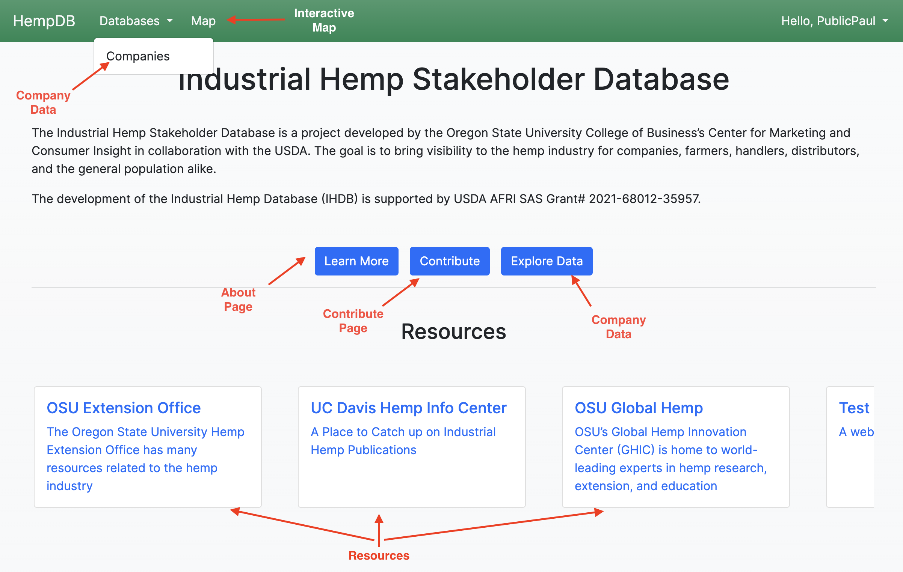
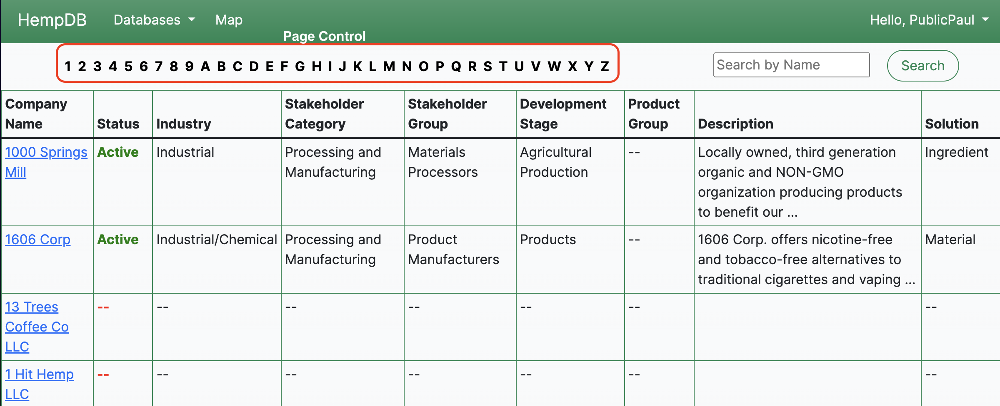

# End User Documentation for HempDB Public Users

This page is a guide on how to use HempDB as a public end-user.

## Creating an Account

Users need an account to access most features on the site. To create an account, navigate to `Log In` in the top right corner. In the log-in form, click `Sign Up`. Fill out the form and click `Sign Up`.

Users will then receive an email asking them to click a link to verify their email. **This email may take up to 5 minutes to send; it may also arrive in "Spam" or similar folders.** To verify successful login, it should say "Hello, \<account name>" as opposed to "Log In". 

## Navigation

Above is an overview highlighting the main links and what's behind them. The navbar is always present, even on 404 or 500 pages, meaning a user can always navigate to a non-error page by clicking on any of the links in the navbar, including on the "HempDB" logo.

## Companies Page

Above is what the top of the companies page will look like. _Note: some buttons may not be viewable to all users._

* Clicking `Export` will allow users to export company data to a CSV. 
* The filter icon button to the right of `Export` allows users to filter by many company attributes.
* The `A-Z, 0-9` row in the middle allows companies to be paginated (when A is selected, companies whose name starts with A will be shown).
* The search bar on the right acts as a normal search bar and will match the company name.

Users can also click on any of the companies to view more information about the specific company. This can be done by clicking on the blue URL in the Company Name column. 

## Map

The map is an interactive map that displays active companies that have locations in the database. The user can:
* Change between standard and satellite views in the top right of the map
* View dense areas of companies using the heatmap
  * Each orange, yellow, and green circle can be hovered over to view an area
  * The number in each circle represents how many companies are in that area
* Click blue markers representing individual companies to see more about the company
* Select and apply filters on the right side of the page to narrow companies displayed

## FAQ

### I landed on a 404 / 500 Error page. What should I do? 

Looks like there was an error with the request. To navigate back to a non-erroring page, simply click on any of the links in the navbar. To report the cause of the error, please open an [issue](https://github.com/cmciosu/hemp-db/issues).