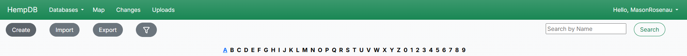

# End User Documentation for HempDB Public Users

### This documentation is a guide on how to use HempDB as a public end-user

## Creating an Account

Users need an account to access most features on the site. To create an account, navigate to `Log In` in the top right corner. In the log-in form, click `Sign Up`. Fill out the form and click `Sign Up`. If the account was successfully created, a user will be automatically logged in and redirected to the home page. To verify successful login, it should now say "Hello, \<account name>" as opposed to "Log In". 

## Navigation

above is a overview highlighting the main links and what's behind them. The navbar is always present, even on 404 or 500 pages, meaning a user can always navigate to a non-error page by clicking on any of the links in the navbar, including on the "HempDB" logo.

## Companies

The Companies table can be searched by either entering a search string into the search bar (this will try to match Company Name), or by clicking any of the letters in the pagination control bar (when A is selected, companies whose name starts with A will be shown). Users can also click on any of the companies to view more information about the specific company. This can be done by clicking on the blue URL in the Company Name column. 

## Map

The map is an interactive embed from ArcGIS. It can be zoomed, scrolled and clicked on. The dots represent entries in the companies table.

## FAQ

### I landed on a 404 / 500 Error page. What should I do? 

Looks like there was an error with the request. To navigate back to a non-erroring page, simply click on any of the links in the navbar. To report the cause of the error, please open an [issue](https://github.com/cmciosu/hemp-db/issues).